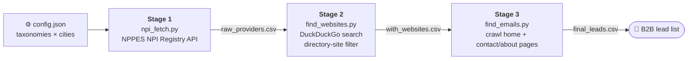

<div align="center">


# Healthcare Provider Lead Generation from the NPI Registry — Automated Python Pipeline on GitHub Actions

**Turns the free U.S. NPPES NPI Registry into a B2B contact list: provider name, phone and address → official practice website → e-mail addresses. Three resumable stages, zero paid APIs, runs on a schedule in GitHub Actions.**

<p>
  
  
  
  
  
  
</p>

[How it works](#-how-it-works) · [Quick start](#-quick-start) · [GitHub Actions](#-run-it-on-github-actions) · [Configuration](#%EF%B8%8F-configuration) · [Output](#-output)

</div>

---

A **lead generation pipeline for healthcare and mental-health practices**. Out of the box it targets **psychiatrists, psychologists, counselors and social workers in Dallas, Houston, Austin and San Antonio, TX** — change two lists in `config.json` and it targets any NPI taxonomy in any U.S. city.

Built for agencies, SaaS founders and sales teams selling into **medical practices, clinics and therapists** who want verified public data instead of stale purchased lists.

## 🔄 How it works



| Stage | Script | What it does |
|---|---|---|
| **1 · Providers** | `npi_fetch.py` | Pages through the official [NPPES NPI Registry API](https://npiregistry.cms.hhs.gov/api-page) for every taxonomy × city pair — active providers only, individuals (NPI-1) and organizations (NPI-2), with retries and polite delays |
| **2 · Websites** | `find_websites.py` | Searches DuckDuckGo for each practice and keeps the first **official** site — skipping directories like Yelp, Healthgrades, Vitals, Zocdoc and Psychology Today |
| **3 · E-mails** | `find_emails.py` | Crawls each website plus up to 3 likely sub-pages (*contact, about, team, staff*) and extracts e-mail addresses |

**Resume-safe by design.** Stages 2 and 3 skip rows already present in their output file, so a crashed or time-limited run picks up exactly where it stopped. Rotating user agents, randomized delays and retry budgets keep the crawl polite.

## ⚡ Quick start

```bash
git clone https://github.com/intikhab49/npi-healthcare-lead-pipeline.git
cd npi-healthcare-lead-pipeline
pip install -r requirements.txt

python run_all.py          # all three stages, with a summary at the end
```

Or run stages individually:

```bash
python npi_fetch.py                              # Stage 1
python find_websites.py --only-orgs --limit 200  # Stage 2 — organizations only, 200 rows
python find_emails.py --max-runtime 3600         # Stage 3 — stop cleanly after an hour
```

| Flag | Stage | Meaning |
|---|---|---|
| `--only-orgs` | 2 | Search organizations only (recommended — practices have websites, individuals often don't) |
| `--limit N` | 2 | Process at most N providers this run (`0` = all) |
| `--max-runtime S` | 2, 3 | Exit gracefully after S seconds, keeping all progress |

## 🤖 Run it on GitHub Actions

`.github/workflows/leadgen.yml` runs the pipeline for free on GitHub's runners:

- **Manual runs** (`workflow_dispatch`) — pick stage `1`, `2`, `3` or `all`, organizations-only, and a row limit.
- **Weekly schedule** — every Monday 04:00 UTC it refreshes NPI data and continues discovery.
- **Stateful between runs** — outputs are restored from and saved to the Actions cache, so each run continues the last one.
- **Never overlaps** — a concurrency group queues runs instead of cancelling them.
- **Downloadable results** — `outputs/` is uploaded as a build artifact (30-day retention).

> [!TIP]
> Keep Stage 2 at 150–250 rows per run to stay comfortably under the 6-hour job limit.

## ⚙️ Configuration

Everything lives in `config.json`:

```jsonc
{
  "taxonomies": [
    { "code": "2084P0800X", "label": "Psychiatry" },
    { "code": "103TC0700X", "label": "Psychologist" }
  ],
  "cities": [ { "city": "Dallas", "state": "TX" } ],
  "npi":    { "limit_per_request": 200, "max_pages_per_query": 20, "delay_seconds": 1.0, "retries": 4 },
  "search": { "max_results_per_query": 5, "delay_range": [3, 7], "retries": 3 },
  "email":  { "max_sub_pages": 3, "delay_range": [1, 3], "retries": 2 }
}
```

Find taxonomy codes for any specialty — dentists, chiropractors, physical therapists, pharmacies — in the [NUCC Health Care Provider Taxonomy](https://taxonomy.nucc.org/).

## 📇 Output

`outputs/final_leads.csv`:

| Column | Example |
|---|---|
| `npi` | 10-digit National Provider Identifier |
| `name` · `phone` · `address` · `city` · `state` · `zip` | From the NPI Registry |
| `taxonomy` · `provider_type` | e.g. *Psychiatry & Neurology, Psychiatry* · *Organization* |
| `website` | Official practice site found in Stage 2 |
| `search_query` | The query used, for auditability |
| `emails` | Semicolon-separated addresses found in Stage 3 |

## 🧭 Responsible use

NPI data is public, but e-mail outreach is regulated. Honor CAN-SPAM (and HIPAA where relevant), include opt-outs, respect `robots.txt` and site terms, and keep crawl rates polite.

---

<div align="center">

**Built by [Intikhab Azam](https://github.com/intikhab49)** — AI & automation engineer · lead generation · data pipelines

Want the Google Maps version for any local business? See **[Local Business Lead Finder](https://github.com/intikhab49/local-business-lead-finder)**.

<sub>Keywords: NPI registry API · NPPES · healthcare lead generation · medical practice leads · therapist e-mail list · B2B lead scraper · e-mail finder · GitHub Actions automation · Python web scraping · DuckDuckGo search</sub>

</div>
